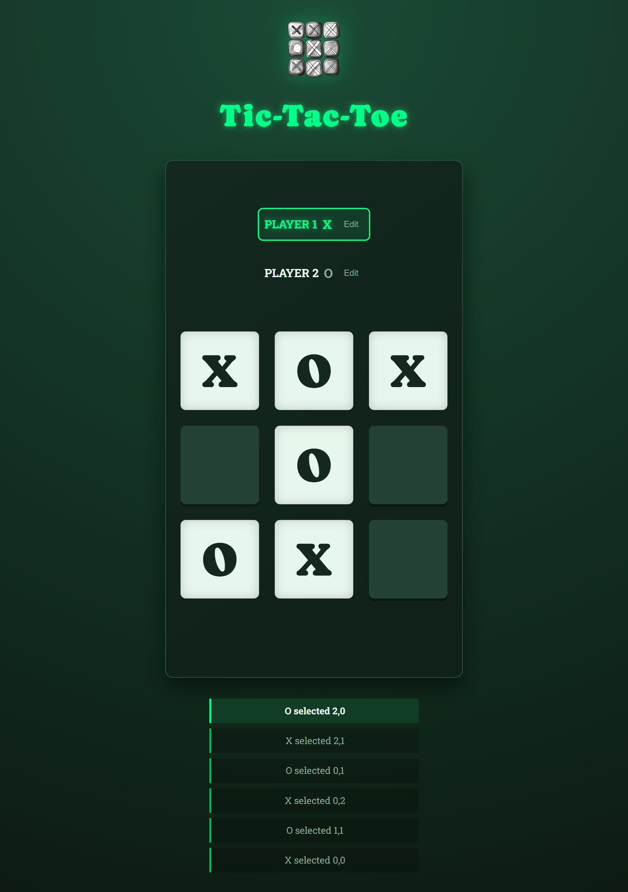

# React Tic-Tac-Toe

A modern, fully responsive Tic-Tac-Toe game built with React, featuring a dynamic "Forest & Neon" theme.

**[Play the Live Demo](https://react-tic-tac-68apuerrb-sujoykrs-projects.vercel.app/)**



## Features

-   **2-Player Local Play:** Play against a friend on the same device.
-   **Customizable Names:** Click "Edit" to change player names.
-   **Move History:** A real-time log tracks every turn taken.
-   **Responsive UI:** Works on mobile and desktop with smooth animations and a neon green aesthetic.

## How to Run

1.  **Install Dependencies:**

    ```bash
    npm install
    ```

2.  **Start the Server:**
    ```bash
    npm run dev
    ```
